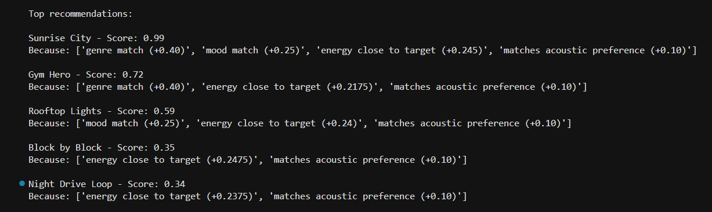

# 🎵 Music Recommender Simulation

## Project Summary

In this project you will build and explain a small music recommender system.

Your goal is to:

- Represent songs and a user "taste profile" as data
- Design a scoring rule that turns that data into recommendations
- Evaluate what your system gets right and wrong
- Reflect on how this mirrors real world AI recommenders

Replace this paragraph with your own summary of what your version does.

---

## How The System Works

Real-word recommendation systems like Spotify work by using both collaborative filtering and content-based filtering. This version
prioritizes content-based filtering; it scores each song by how closely its features match a single user's taste profile. It prioritizes energy and acousticness, supported by genre and mood as categorical filters. The result is a transparent, math-driven recommender where every recommendation can be explained by specific song attributes — simpler than what Spotify runs, but built on the same core idea.

Song features used:
1. genre
2. mood
3. energy
4. acousticness

### User Profile

| Field | Type | Description |
|---|---|---|
| `favorite_genre` | str | The genre the user prefers |
| `favorite_mood` | str | The mood the user prefers |
| `target_energy` | float | The energy level the user wants (0.0 – 1.0) |
| `likes_acoustic` | bool | Whether the user prefers acoustic sound |

### Scoring Formula

Each song receives a weighted score between 0.0 and 1.0:

```
score = (0.40 × genre) + (0.25 × mood) + (0.25 × energy) + (0.10 × acousticness)
```

| Feature | Weight | How It Is Calculated |
|---|---|---|
| Genre | 0.40 | `1.0` if `song.genre == user.favorite_genre`, else `0.0` |
| Mood | 0.25 | `1.0` if `song.mood == user.favorite_mood`, else `0.0` |
| Energy | 0.25 | `1.0 - abs(song.energy - user.target_energy)` |
| Acousticness | 0.10 | `1.0` if acousticness preference aligns, else `0.0` |

### Pipeline

```
Input (User Profile + songs.csv)
  → Load all songs into Song objects
  → Score every song using the weighted formula
  → Sort by score descending
  → Return top k recommendations
  → Generate an explanation string per song
```




### Potential Biases
- Genre dominance: At 0.40, a genre match is worth more than mood and acousticness combined. Users whose favorite genre is underrepresented in the catalog (e.g. only 1 reggae song) will consistently get poor results regardless of how well other features match.

- Hard binary cutoffs: Genre and mood are exact string matches. "Indie pop" never matches "pop." "Relaxed" never matches "chill." Small catalog label inconsistencies will cause disproportionate score drops.

- Acousticness threshold — The > 0.5 cutoff treats 0.49 and 0.51 as opposites. Songs near the boundary are arbitrarily penalized or rewarded.s
---

## Getting Started

### Setup

1. Create a virtual environment (optional but recommended):

   ```bash
   python -m venv .venv
   source .venv/bin/activate      # Mac or Linux
   .venv\Scripts\activate         # Windows

2. Install dependencies

```bash
pip install -r requirements.txt
```

3. Run the app:

```bash
python -m src.main
```

### Running Tests

Run the starter tests with:

```bash
pytest
```

You can add more tests in `tests/test_recommender.py`.

---

## Experiments You Tried

Use this section to document the experiments you ran. For example:

- What happened when you changed the weight on genre from 2.0 to 0.5
- What happened when you added tempo or valence to the score
- How did your system behave for different types of users

---

## Limitations and Risks

Summarize some limitations of your recommender.

Examples:

- It only works on a tiny catalog
- It does not understand lyrics or language
- It might over favor one genre or mood

You will go deeper on this in your model card.

---

## Reflection

Read and complete `model_card.md`:

[**Model Card**](model_card.md)

Write 1 to 2 paragraphs here about what you learned:

- about how recommenders turn data into predictions
- about where bias or unfairness could show up in systems like this


---

## 7. `model_card_template.md`

Combines reflection and model card framing from the Module 3 guidance. :contentReference[oaicite:2]{index=2}  

```markdown
# 🎧 Model Card - Music Recommender Simulation

## 1. Model Name

Give your recommender a name, for example:

> VibeFinder 1.0

---

## 2. Intended Use

- What is this system trying to do
- Who is it for

Example:

> This model suggests 3 to 5 songs from a small catalog based on a user's preferred genre, mood, and energy level. It is for classroom exploration only, not for real users.

---

## 3. How It Works (Short Explanation)

Describe your scoring logic in plain language.

- What features of each song does it consider
- What information about the user does it use
- How does it turn those into a number

Try to avoid code in this section, treat it like an explanation to a non programmer.

---

## 4. Data

Describe your dataset.

- How many songs are in `data/songs.csv`
- Did you add or remove any songs
- What kinds of genres or moods are represented
- Whose taste does this data mostly reflect

---

## 5. Strengths

Where does your recommender work well

You can think about:
- Situations where the top results "felt right"
- Particular user profiles it served well
- Simplicity or transparency benefits

---

## 6. Limitations and Bias

Where does your recommender struggle

Some prompts:
- Does it ignore some genres or moods
- Does it treat all users as if they have the same taste shape
- Is it biased toward high energy or one genre by default
- How could this be unfair if used in a real product

---

## 7. Evaluation

How did you check your system

Examples:
- You tried multiple user profiles and wrote down whether the results matched your expectations
- You compared your simulation to what a real app like Spotify or YouTube tends to recommend
- You wrote tests for your scoring logic

You do not need a numeric metric, but if you used one, explain what it measures.

---

## 8. Future Work

If you had more time, how would you improve this recommender

Examples:

- Add support for multiple users and "group vibe" recommendations
- Balance diversity of songs instead of always picking the closest match
- Use more features, like tempo ranges or lyric themes

---

## 9. Personal Reflection

A few sentences about what you learned:

- What surprised you about how your system behaved
- How did building this change how you think about real music recommenders
- Where do you think human judgment still matters, even if the model seems "smart"

